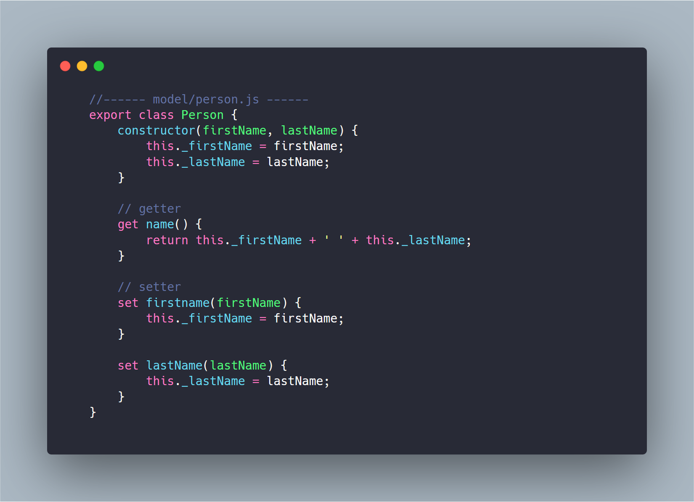

# ECMAScript Modules example with Node

## Requirements

## Example

## package.json

## Run the example

## Links

**[Node.js Documentation](https://nodejs.org/api/esm.html)**

**[nodejs/modules (github)](https://github.com/nodejs/modules)**

**[tc39](https://tc39.es/ecma262/#sec-modules)**

**[exploringjs](https://exploringjs.com/es6/ch_modules.html)**
